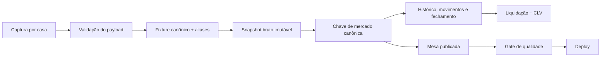

# Relatório de melhoria — Valor RDU / Mesa de Aberturas

Data da análise: 13/07/2026. Este documento é uma proposta de produto e de engenharia baseada na versão publicada e no código em `RDU Aberturas`. Não altera a lógica do site por si só.

## 1. Resumo executivo

O Valor RDU já possui uma base muito boa: cinco fontes de odds, captura paralela, bloqueio de deploy ruim, unificação com fixtures, banco de ticks, liquidação e uma interface leve, legível e responsiva. A oportunidade agora não é adicionar mais informação à mesa; é transformar a informação existente em uma ferramenta de decisão confiável e fácil de navegar.

As três prioridades são:

1. **Confiabilidade do histórico.** Corrigir a identidade do jogo entre casas e fazer a captura de fechamento realmente ocorrer. Sem isso, CLV, gráficos de movimento e comparações entre casas podem ficar fragmentados.
2. **Hierarquia da interface.** A primeira tela deve responder “o que merece atenção agora?”, e não começar arbitrariamente em um mercado. A mesa detalhada continua existindo para investigação.
3. **Transparência do modelo.** Cada sinal de valor precisa comunicar cobertura, versão do modelo, qualidade do pareamento e idade da odd. EV sozinho não é um indicador de confiança.

Na fotografia analisada, a mesa tinha 134 jogos e 93 flags de valor: 85 em Escanteios e 8 em Cartões. Porém, a tela abre em Cartões; portanto a maior parte da cobertura fica escondida atrás do filtro. O Histórico tinha 2.623 linhas monitoradas, 125 liquidadas e ainda 0 observações válidas de CLV pré-jogo — é cedo para tirar conclusão de performance.

## 2. Problemas e oportunidades já comprovados

### P0 — identidade duplicada no Histórico

O Histórico ainda normaliza os times de forma mais simples que a Mesa. Assim, variações como `Ceará` / `Ceará CE`, `CRB` / `CRB AL` e `Operário PR` / `Operário Ferroviário` criam confrontos separados entre casas. Foram encontrados 40 jogos visíveis que correspondem a 31 confrontos canônicos; 8 confrontos tinham variação de nome entre fontes.

**Efeito:** a linha de odds, os movimentos e o futuro CLV ficam repartidos; o usuário enxerga jogos repetidos e perde a comparação real entre casas.

**Correção:** extrair a normalização de `build_board.py` para um único módulo compartilhado por `build_board.py`, `history_ingest.py`, `history_settle.py` e `build_moves.py`. A chave definitiva deve preferir `sofa_id` e usar uma chave canônica de fallback somente quando não houver fixture confiável. Nomes crus devem ser preservados como metadados, nunca como identidade.

Também é necessário reprocessar as chaves e ticks já existentes; corrigir somente entradas futuras deixa o banco histórico partido em duas regras.

### P0 — o modo de fechamento não roda pelo agendamento atual

O workflow descreve três modos: `full`, `close` e `skip`. Mas, nos únicos gatilhos existentes, o fluxo manual retorna `full`; no cron, se a captura tem menos de 25 minutos retorna `skip`, e caso contrário retorna `full` antes de chegar ao trecho que avalia jogos em até 75 minutos. Na prática, a rota `close` fica inalcançável.

**Efeito:** o “close” é normalmente a última captura de rotina e pode ficar distante do apito. Isso reduz a qualidade do CLV e dos gráficos pré-jogo.

**Correção recomendada:** separar explicitamente descoberta e fechamento.

| Janela | Objetivo | Frequência sugerida |
| --- | --- | --- |
| Sem jogo próximo | Descobrir jogos, mercados e aberturas | a cada 60 min |
| T-120 a T-60 | Iniciar acompanhamento | a cada 30 min |
| T-60 a T-10 | Medir movimento pré-jogo | a cada 10 min |
| T-10 ao início | Fechamento | a cada 3–5 min, dentro dos limites permitidos pelas fontes |

O gate deve decidir `close` **antes** do retorno genérico de `full`, e o relatório operacional deve guardar qual modo foi executado. Toda captura deve respeitar os termos, limites e APIs permitidas pelas fontes.

### P1 — o site mostra uma parte pequena do que possui

O primeiro mercado escolhido pela interface é Cartões. Na amostra revisada, havia 123 jogos com Escanteios, contra 8 com Cartões e 4 nos demais mercados de estatística. Há também 85 dos 93 sinais atuais em Escanteios. Isso não significa que Escanteios seja melhor; significa que a organização atual esconde a principal massa de dados.

**Correção:** substituir a abertura automática por uma visão “Resumo” e deixar a Mesa completa como segunda camada. A descrição da página também precisa incluir todos os mercados realmente suportados: hoje ela cita seis e omite Escanteios, Chutes no gol e Desarmes.

### P1 — CLV e resultado ainda não têm base para avaliação

O banco já tem arquitetura correta de abertura, último preço, fechamento, resultado e `clv_valido`. Mas as 125 linhas liquidadas ainda não têm abertura observada antes do kickoff; portanto o CLV agregado não é utilizável. Há também capturas tardias, inclusive depois do jogo, que são corretamente excluídas do cálculo, mas deveriam ficar visíveis como qualidade de captura.

**Correção:** tratar o Histórico como “em formação” até haver uma amostra pré-jogo suficiente. Exibir sempre `N` e intervalos de incerteza; não apresentar taxa de green, ROI ou CLV como prova de qualidade quando a amostra é pequena ou enviesada.

## 3. Nova arquitetura de informação

Manter a identidade visual atual — Space Grotesk, Inter, fundo claro e roxo/verde — é uma boa decisão. A melhoria deve ser de hierarquia, não de enfeite.

### Navegação proposta

1. **Visão geral** — o que mudou, o que está próximo e quais dados são confiáveis.
2. **Mesa** — comparação completa por jogo, mercado, linha e casa.
3. **Valor do modelo** — somente linhas elegíveis, com explicação e score de confiança.
4. **Histórico & CLV** — auditoria de preço, movimento, fechamento e liquidação.
5. **Operação** — saúde das capturas, cobertura por casa e logs resumidos; pode ser uma área interna.

### Visão geral

O topo deve ser um painel pequeno, com quatro cartões: atualização da mesa, casas saudáveis na rodada publicada, jogos nas próximas 24 horas e linhas com modelo/cobertura válida. Abaixo dele:

- **Destaques agora:** até 5 linhas ordenadas por confiança, não somente por EV.
- **Próximos kickoffs:** cronologia compacta com mercado e número de casas.
- **Cobertura por mercado:** cartões com jogos, casas e linhas disponíveis; isso revela imediatamente quando há muito Escanteio e pouco Faltas, por exemplo.
- **Avisos honestos:** “captura parcial”, “odd com mais de X min”, “pareamento por fallback” ou “modelo sem validação recente”.

### Mesa

A Mesa deve ser a tela de investigação, não uma lista infinita.

- Busca por time, jogo ou liga.
- Filtros por horário, mercado, casa, número de casas, modelo disponível, somente valor e frescor da odd.
- Agrupar primeiro por horário/competição e depois por jogo.
- No cartão fechado, mostrar a linha principal consensual, melhor odd por lado, número de casas e último update.
- Ao expandir, exibir a escada de linhas e uma matriz “casas × odds”. Destacar a melhor odd sem esconder as demais.
- Sinalizar claramente se uma comparação usa uma única casa, pareamento fuzzy ou fixture canônico confirmado.

### Valor do modelo

Em vez de listar só “EV +X%”, cada item deve ter:

- mercado, lado, linha, casa e odd;
- probabilidade do modelo, probabilidade de mercado sem vig e odd justa;
- EV e edge em pontos percentuais;
- hora da captura e tempo até o kickoff;
- versão/validade do modelo;
- **score de confiança**: cobertura do modelo, qualidade da captura, número de casas comparáveis, frescor, qualidade do match e estabilidade da linha.

O score é um indicador de qualidade de dados, não uma previsão adicional. Isso evita que uma linha com EV alto, mas odd velha ou pareamento fraco, apareça acima de uma linha melhor sustentada.

Também vale separar filtros: “todos os sinais”, “alta confiança”, “mais de uma casa” e “próximos 90 minutos”. A distribuição por mercado deve aparecer no topo para deixar claro que, no momento, muitos sinais podem se concentrar em uma mesma categoria.

### Histórico & CLV

Após a correção da chave canônica, o Histórico deve ser organizado em três níveis:

1. **Resumo:** quantidade de observações válidas, cobertura temporal, CLV médio/mediano, taxa de fechamento batido e qualidade das capturas.
2. **Explorador de jogo:** jogo → mercado → linha → casa, com a série temporal de odds e o resultado, quando houver.
3. **Auditoria de dados:** linhas tardias, sem fechamento, sem resultado, sem par over/under, mudanças de nome e falhas por fonte.

O valor “green/red” deve continuar existindo, mas como resultado descritivo. Não deve substituir CLV, calibração e amostra como critério de avaliação do modelo.

## 4. Gráficos que realmente ajudam

Os gráficos precisam responder a uma pergunta operacional. Evitar gráficos decorativos ou dezenas de mini-gráficos iguais.

| Gráfico | Pergunta que responde | Local | Regra de exibição |
| --- | --- | --- | --- |
| Cobertura casas × mercados | Onde há comparação real hoje? | Visão geral | heatmap simples |
| Captura ao longo do dia | Alguma casa ou parser caiu? | Operação | última 24h e 7 dias |
| Odds vs. tempo | Como cada casa moveu a linha? | Detalhe do jogo | sempre com horário de kickoff marcado |
| Abertura vs. fechamento | A abertura costuma antecipar o mercado? | Histórico | só com `clv_valido` |
| CLV acumulado | Há melhora consistente, e não um pico isolado? | Histórico | mínimo de 30 linhas válidas |
| Distribuição de CLV | A média é puxada por poucos extremos? | Histórico | mostrar mediana e percentis |
| Calibração | Probabilidades de 55% acontecem perto de 55%? | Modelos | por mercado e faixa de probabilidade |
| Cobertura temporal | Quanto antes do jogo a primeira e a última odd foram vistas? | Operação | histograma por casa |

Para o gráfico “Odds vs. tempo”, preservar o SVG atual é adequado. Melhorias: eixo temporal em BRT, linha vertical do kickoff, marcador da abertura/última captura, tooltip em cada ponto e sobreposição opcional de mais de uma casa. Não misturar mercados nem linhas diferentes no mesmo gráfico.

Para CLV e calibração, mostrar sempre `N`, período analisado e intervalo de confiança. Se não houver dados suficientes, mostrar uma mensagem útil, não um gráfico vazio.

## 5. Captura e banco de dados

### Fluxo recomendado

### Contrato mínimo de uma observação

Cada odd precisa carregar, além de preço e seleção:

`capture_id`, `source`, `source_event_id`, `fixture_id`/`sofa_id`, `home_raw`, `away_raw`, `market_id`, `market_name`, `line`, `side`, `odd_decimal`, `captured_at_utc`, `kickoff_at_utc`, `parser_version`, `model_version` e `match_confidence`.

Guardar horário em UTC no banco e converter para BRT apenas na interface elimina ambiguidade. Guardar o payload bruto ou um snapshot normalizado imutável permite corrigir parsers e reconstruir o histórico sem perder evidência.

### Identidade canônica

A identidade deve ser:

`fixture_id | market_id | line | side | house`

Quando não houver `fixture_id`, usar uma chave de fallback com data/hora, times normalizados, competição e score de pareamento. O sistema deve registrar a origem do match: `exact_source_id`, `sofa_exact`, `sofa_fuzzy`, `alias` ou `unmatched`. Um match `unmatched` não deve alimentar CLV ou comparação entre casas sem revisão.

### Regras de qualidade antes de publicar

- Validar odd decimal, linha, lado, kickoff futuro e mercado permitido.
- Rejeitar ou marcar observações sem par over/under quando a métrica exige de-vig.
- Separar “última captura bem-sucedida” de “última tentativa”.
- Medir cobertura por casa, mercado e janela de kickoff.
- Bloquear deploy se a nova mesa perder cobertura relevante, repetir um jogo ou tiver frescor acima do limite.
- Versionar normalizador, parser e modelo junto com a observação.

## 6. Evolução dos modelos e do +EV

Hoje o pacote de precificação contém Cartões, Finalizações, Faltas e Escanteios, mas não carrega metadados de versão, data de treino, corte da base ou métricas de validação. Isso dificulta saber se um sinal foi produzido antes ou depois de uma recalibração.

Adicionar ao `pricer_data.json`:

- `schema_version` e `generated_at`;
- versão por modelo;
- ligas suportadas e cobertura por liga;
- período de treino/validação;
- tamanho de amostra;
- Brier score, log loss e gráfico/tabela de calibração;
- regra de elegibilidade e limites aplicados.

No site, disponibilizar um botão “Como este valor foi calculado?” com linguagem direta: média projetada, probabilidade do modelo, probabilidade sem vig, margem da casa e restrições aplicadas. O objetivo é auditoria, não transformar a tela em um relatório estatístico pesado.

Antes de usar resultado financeiro como métrica de modelo, priorizar:

1. integridade de captura pré-jogo;
2. CLV por mercado/casa/horário;
3. calibração da probabilidade;
4. estabilidade fora da amostra;
5. só então resultado de linhas efetivamente registradas.

## 7. Engenharia, testes e operação

### Modularização

O projeto ainda é pequeno o suficiente para permanecer estático; não é necessário migrar para um framework agora. Porém, `history.js` já concentra bastante estado, renderização e SVG. Separar em módulos melhora manutenção:

- `shared/canonical.py`: normalização e aliases;
- `shared/schema.py`: validação do payload;
- `shared/time.py`: UTC/BRT e janelas;
- `js/ui.js`, `js/board-view.js`, `js/history-view.js`, `js/charts.js`;
- arquivos de configuração para mercados, casas, ligas e thresholds.

### Testes que devem existir

Não há suíte de testes configurada hoje. Os primeiros testes devem ser pequenos e objetivos:

- tabela de aliases e normalização de time;
- fixture matching com casos reais de variações entre casas;
- parsing de cada casa a partir de payloads arquivados;
- chave de histórico idempotente;
- cálculo de de-vig, EV e CLV;
- `build_board` com snapshot esperado;
- gate bloqueando regressões de cobertura e duplicações;
- smoke test do site publicado: arquivos carregam, dados parseiam e filtros principais renderizam.

Evitar `except Exception: pass` onde uma falha deveria gerar status ou log estruturado. Falhas toleráveis devem ser marcadas por fonte/etapa, não desaparecer.

### Observabilidade

Criar um `run_id` por workflow e publicar um resumo compacto:

- início/fim e duração por fonte;
- eventos, mercados e linhas aceitas/rejeitadas;
- motivo das rejeições;
- cobertura por mercado;
- última captura válida antes de cada kickoff;
- último deploy e hash da mesa;
- alertas de regressão.

Na área interna, uma tabela de saúde de sete dias é mais útil que logs brutos. Para o público, basta um selo de frescor e captura parcial quando necessário.

## 8. Roadmap de implementação

| Prioridade | Entrega | Resultado esperado |
| --- | --- | --- |
| P0 | Normalizador compartilhado + migração das chaves históricas | jogo único entre casas, movimentos e CLV íntegros |
| P0 | Corrigir gate para executar `close` de fato | último preço mais próximo do kickoff |
| P0 | Testes de aliases, chaves e build | evitar regressão silenciosa |
| P1 | Visão geral, busca e filtros de qualidade | descoberta rápida sem esconder Escanteios e outros mercados |
| P1 | Score de confiança e metadados do modelo | +EV interpretável e auditável |
| P1 | Área de operação/cobertura | detectar fonte, parser ou mercado degradado |
| P1 | Gráficos de movimento e CLV com `N`/incerteza | análise estatística honesta |
| P2 | Modularizar front-end e criar schema versionado | manutenção mais simples |
| P2 | Arquivo de snapshots em formato analítico (Parquet/DuckDB) | histórico escalável e reprocessável |

## 9. Critérios de aceite

Uma melhoria só deve ser considerada pronta quando:

- o mesmo confronto aparece uma única vez no Histórico, independente da grafia da casa;
- o painel mostra primeira e última odd pré-jogo por casa e indica observações tardias;
- a captura de fechamento é auditável por horário e `run_id`;
- a Visão geral mostra toda a cobertura, não apenas o primeiro mercado;
- todo sinal de valor exibe frescor, fonte, modelo e confiança;
- CLV só aparece como métrica quando a amostra e a captura pré-jogo são válidas;
- testes cobrem aliases, parsing, geração de chave e gates de qualidade;
- qualquer queda de cobertura é visível antes do deploy.

## 10. Próximo passo recomendado

Começar pelo P0 na seguinte ordem: (1) normalização/chave canônica e reprocessamento do Histórico; (2) correção do agendamento `close`; (3) testes e painel de saúde mínimo. Depois, construir a Visão geral e o score de confiança. Assim o ganho visual vem apoiado em dados que podem ser auditados e comparados ao longo do tempo.
